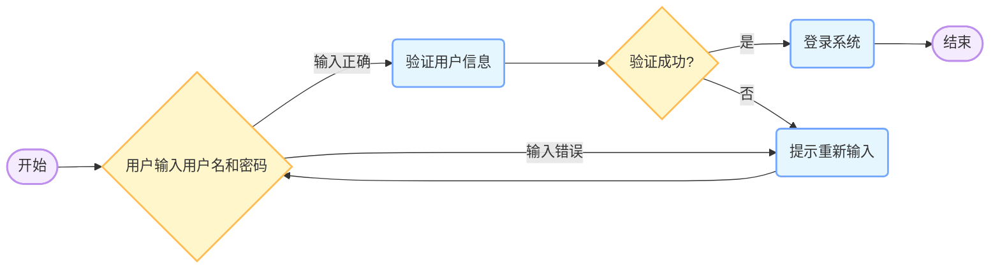
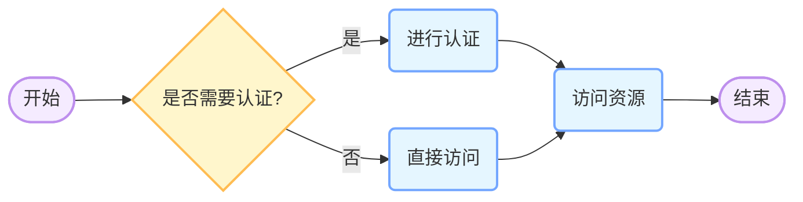

Markdown是一种轻量级标记语言，虽然语法相对简洁，但涵盖了文本格式设置、列表、链接、图片、代码块等多种功能。以下是一个展示Markdown常见语法的示例：

# Markdown语法示例

## 1. 标题
### 1.1 一级标题
# 这是一级标题

### 1.2 二级标题
## 这是二级标题

### 1.3 三级标题
### 这是三级标题

### 1.4 四级标题
#### 这是四级标题

### 1.5 五级标题
##### 这是五级标题

### 1.6 六级标题
###### 这是六级标题

## 2. 文本格式
### 2.1 加粗
**这是加粗的文本**

### 2.2 斜体
*这是斜体的文本*

### 2.3 加粗斜体
***这是加粗斜体的文本***

### 2.4 删除线
~~这是删除线文本~~

### 2.5 下划线（在标准Markdown中无直接语法，HTML中可实现）
<u>这是下划线文本</u>

## 3. 列表
### 3.1 无序列表
- 项目1
- 项目2
  - 子项目1
  - 子项目2

### 3.2 有序列表
1. 第一项
2. 第二项
3. 第三项

## 4. 引用
> 这是一段引用文本。
> 引用可以有多行。
> 
> > 还可以嵌套引用。

## 5. 链接
### 5.1 行内式链接
[百度](https://www.baidu.com)

### 5.2 参考式链接
[Google][1]

[1]: https://www.google.com

### 5.3 自动链接
<https://example.com>

## 6. 图片
### 6.1 行内式图片


### 6.2 参考式图片
![替代文本][2]

[2]: https://gips1.baidu.com/it/u=1971954603,2916157720&fm=3028&app=3028&f=JPEG&fmt=auto?w=1920&h=2560"图片标题"

## 7. 代码块
### 7.1 行内代码
`print("这是行内代码")`

### 7.2 代码块（无指定语言）
```
for i in range(10):
    print(i)
```

### 7.3 代码块（指定语言，如Python）
```python
def add(a, b):
    return a + b
```

### 7.4 代码块（指定语言，如HTML）
```html
<!DOCTYPE html>
<html>
<head>
    <title>示例页面</title>
</head>
<body>
    <p>这是一个简单的HTML页面</p>
</body>
</html>
```

## 8. 表格
| 表头1 | 表头2 | 表头3 |
| ---- | ---- | ---- |
| 内容1 | 内容2 | 内容3 |
| 内容4 | 内容5 | 内容6 |

## 9. 分隔线
---
或
***

## 10. 转义字符
要显示特殊字符本身，如 `#`，可以使用反斜杠转义：\# ，显示为 `#`。

以上涵盖了Markdown常见的大部分语法，不同的Markdown解析器可能在细节上略有差异，但基本的语法规则是通用的。 




